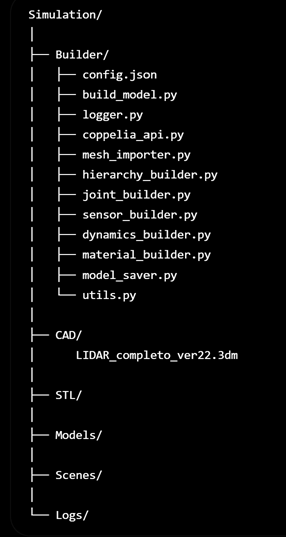

# GIAR-Simulation-Pipeline-LiDAR(GSPL)
UTN-FRBA-GIAR
***
## 1. Introducción

***
## 2. Estructura del repositorio

# GIAR CoppeliaSim Model Builder (GSPL)

## Development Pipeline

| Etapa | Módulo              | Objetivo                                                                                          | Estado |
| :---: | ------------------- | ------------------------------------------------------------------------------------------------- | :----: |
|  01   | Config Loader       | Leer y validar el archivo `config.json`. Verificar directorios y parámetros de configuración.     |   ⬜    |
|  02   | Logger              | Inicializar el sistema de registro de eventos y generar el archivo de log del proceso.            |   ⬜    |
|  03   | Coppelia Connection | Establecer la conexión con CoppeliaSim mediante la API ZMQ Remote API.                            |   ⬜    |
|  04   | Scene Builder       | Crear una escena vacía y configurar el motor físico y la gravedad.                                |   ⬜    |
|  05   | Mesh Importer       | Importar automáticamente todos los archivos STL del proyecto y aplicar la escala correspondiente. |   ⬜    |
|  06   | Hierarchy Builder   | Construir la jerarquía completa del modelo según la estructura mecánica del ensamblaje.           |   ⬜    |
|  07   | Joint Builder       | Crear y configurar las articulaciones (Revolute Joints) del NEMA17 y del micromotor.              |   ⬜    |
|  08   | Sensor Builder      | Crear el TFMini-S virtual y los dos sensores Hall.                                                |   ⬜    |
|  09   | Dynamics Builder    | Configurar masas, inercias, propiedades dinámicas y objetos respondables.                         |   ⬜    |
|  10   | Material Builder    | Asignar colores, materiales y propiedades visuales a cada componente.                             |   ⬜    |
|  11   | Script Builder      | Crear automáticamente los scripts Lua asociados al modelo.                                        |   ⬜    |
|  12   | Model Saver         | Guardar el modelo como `GIAR_Low_Cost_3D_LiDAR.ttm`.                                              |   ⬜    |
|  13   | Report Generator    | Generar un informe del proceso de construcción y estadísticas del modelo.                         |   ⬜    |
|  14   | Validation          | Verificar la integridad del modelo generado y realizar pruebas automáticas.                       |   ⬜    |
