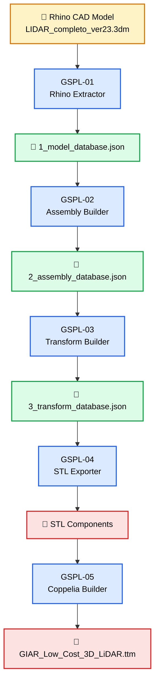

# GIAR-Simulation-Pipeline-LiDAR(GSPL)
UTN-FRBA-GIAR
***
## 1. Introducción

***
## 2. Estructura del repositorio

***

## 3. Implementación del pipeline
La siguiente figura muestra cómo se va implementando:

The **GIAR Simulation Pipeline for LiDAR (GSPL)** is composed of five independent programs. Each program has a single responsibility and receives the JSON database generated by the previous stage, enriches it with new information, and produces a new output database.

|     Nº      | Program               | Description                                                                                                                             | Input                                       | Output                                    |
| :---------: | --------------------- | --------------------------------------------------------------------------------------------------------------------------------------- | ------------------------------------------- | ----------------------------------------- |
| **GSPL-01** | **Rhino Extractor**   | Reads the Rhino `.3dm` CAD model, performs geometry validation, extracts all components, and generates the initial model database.      | `LIDAR_completo_ver23.3dm`                  | `1_model_database.json` `1_assembly.json` |
| **GSPL-02** | **Assembly Builder**  | Reads `assembly.json`, builds the parent-child hierarchy of the assembly, validates the structure, and generates the assembly database. | `1_model_database.json` + `1_assembly.json` | `2_assembly_database.json`                |
| **GSPL-03** | **Transform Builder** | Computes transformations, component centers, and bounding boxes, updating the assembly database with geometric information.             | `2_assembly_database.json`                  | `3_transform_database.json`               |
| **GSPL-04** | **STL Exporter**      | Exports one STL file for each component and updates the database with the generated mesh information.                                   | `3_transform_database.json`                 | `STL/*.stl` + updated database            |
| **GSPL-05** | **Coppelia Builder**  | Builds the complete CoppeliaSim model (`.ttm`) from the component database and exported STL files.                                      | Updated database + STL files                | `GIAR_Low_Cost_3D_LiDAR.ttm`              |

---

## Design Principles

The GSPL architecture follows these design principles:

- **Single Responsibility:** Each program performs only one well-defined task.
- **Sequential Pipeline:** Every program reads the output produced by the previous stage.
- **Incremental Database:** Information is never discarded; each stage enriches the existing database.
- **Modular Architecture:** Each program can be executed independently.
- **Auditable Process:** Every stage produces log files and intermediate databases, simplifying debugging and validation.

## 4. Versiones de la GSPL-01_Rhino_Extractor.py

|   ID    | Tarea                                            | Estado | Observaciones                                 |
| :-----: | ------------------------------------------------ | :----: | --------------------------------------------- |
| Ver 0.1 | Leer `config.json` y verificar el proyecto       |   ✔    |                                               |
| Ver 0.2 | Leer todos los objetos de Rhino y busca errores. |   ✔    | Se implementa una clase "RhinoExtractor"      |
| Ver 0.3 | Generar `1_model_database.json`                |   ✔    | 1-Inicializo la DB 2-Recorro el .3dm 3-Guardo |
| Ver 0.4 | Generar 1_assembly.json                |   ✔    |                                               |

## 5. Editar el archivo `1_assembly.json`

Este archivo lo genera el GSPL-01_Rhino_Extractor.py y es la base de que usaremos para  generar los objetos en CoppeliaSim. El ingeniero lo debe completar lo más detalladamente posible.

[GSPL-SPEC-002 - Specification of 1_assembly.json](Documentation/GSPL-SPEC-002.md)

## 5. Versiones de la  GSPL-02_Assembly_Builder.py

|   ID    | Tarea                                            | Estado | Observaciones                                 |
| :-----: | ------------------------------------------------ | :----: | --------------------------------------------- |
| Ver 0.1 | Leer `config.json` y verificar el proyecto       |   ✔    |                                               |
| Ver 0.2 | Leer todos los objetos de Rhino y busca errores. |   ✔    | Se implementa una clase "RhinoExtractor"      |
| Ver 0.3 | Generar `1_model_database.json`o                 |   ✔    | 1-Inicializo la DB 2-Recorro el .3dm 3-Guardo |
| Ver 0.4 | Exportar automáticamente un STL por objeto       |   ❌    |                                               |
| Ver 0.5 | **v0.5** Obtener la jerarquía padre-hijo         |   ❌    |                                               |
| Ver 0.6 | Obtener las transformaciones                     |   ❌    |                                               |
| Ver 0.8 | Generar la base de datos completa                |   ❌    |                                               |
|         |                                                  |        |                                               |

## GSPL-03 → Transform Builder

## GSPL-04 → STL Exporter

## GSPL-05 → Coppelia Builder

## 5. GIAR CoppeliaSim Model Builder (GSPL)

## Development Pipeline

| Etapa | Módulo              | Objetivo                                                                                          | Estado |
| :---: | ------------------- | ------------------------------------------------------------------------------------------------- | :----: |
|  01   | Config Loader       | Leer y validar el archivo `config.json`. Verificar directorios y parámetros de configuración.     |   ⬜    |
|  02   | Logger              | Inicializar el sistema de registro de eventos y generar el archivo de log del proceso.            |   ⬜    |
|  03   | Coppelia Connection | Establecer la conexión con CoppeliaSim mediante la API ZMQ Remote API.                            |   ⬜    |
|  04   | Scene Builder       | Crear una escena vacía y configurar el motor físico y la gravedad.                                |   ⬜    |
|  05   | Mesh Importer       | Importar automáticamente todos los archivos STL del proyecto y aplicar la escala correspondiente. |   ⬜    |
|  06   | Hierarchy Builder   | Construir la jerarquía completa del modelo según la estructura mecánica del ensamblaje.           |   ⬜    |
|  07   | Joint Builder       | Crear y configurar las articulaciones (Revolute Joints) del NEMA17 y del micromotor.              |   ⬜    |
|  08   | Sensor Builder      | Crear el TFMini-S virtual y los dos sensores Hall.                                                |   ⬜    |
|  09   | Dynamics Builder    | Configurar masas, inercias, propiedades dinámicas y objetos respondables.                         |   ⬜    |
|  10   | Material Builder    | Asignar colores, materiales y propiedades visuales a cada componente.                             |   ⬜    |
|  11   | Script Builder      | Crear automáticamente los scripts Lua asociados al modelo.                                        |   ⬜    |
|  12   | Model Saver         | Guardar el modelo como `GIAR_Low_Cost_3D_LiDAR.ttm`.                                              |   ⬜    |
|  13   | Report Generator    | Generar un informe del proceso de construcción y estadísticas del modelo.                         |   ⬜    |
|  14   | Validation          | Verificar la integridad del modelo generado y realizar pruebas automáticas.                       |   ⬜    |
