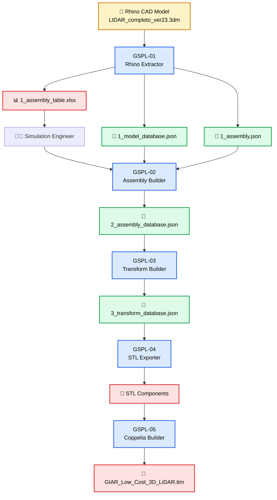

# GIAR-Simulation-Pipeline-LiDAR (GSPL)

UTN-FRBA-GIAR

***

## 1. Introducción

The **GIAR Simulation Pipeline for LiDAR (GSPL)** is an engineering framework developed by **GIAR (Grupo de Inteligencia Artificial y Robótica)** for transforming CAD models created in **Rhino** into complete robotic simulation models for **CoppeliaSim**.

Rather than being a simple CAD converter, the GSPL defines a complete engineering workflow composed of independent programs, intermediate databases and engineering interfaces. Each stage has a single responsibility and enriches the engineering information until the final simulation model is generated.

The current implementation uses the **GIAR Low Cost 3D LiDAR** as the reference project. However, the pipeline architecture has been designed to support a wide variety of robotic and mechatronic systems with minimal modifications.

The GSPL philosophy is based on four fundamental principles:

- **Engineering First:** Engineers work with engineering concepts rather than simulator-specific details.
- **Modular Pipeline:** Each program performs a single well-defined task.
- **Traceability:** Every engineering decision can be traced from the final simulation model back to the original CAD component.
- **Extensibility:** New simulation platforms and engineering capabilities can be incorporated without redesigning the pipeline.

***

## 2. Estructura del repositorio

```
GIAR-Simulation-Pipeline-LiDAR/

├── Documentation/
│   ├── GSPL-SPEC-001.md
│   ├── GSPL-SPEC-002.md
│   └── ARCHITECTURE.md
│
├── Input/
│   └── LIDAR_completo_ver23.3dm
│
├── Output/
│   ├── Database/
│   ├── STL/
│   └── Logs/
│
├── Software/
│   ├── GSPL-01_Rhino_Extractor.py
│   ├── GSPL-02_Assembly_Builder.py
│   ├── GSPL-03_Transform_Builder.py
│   ├── GSPL-04_STL_Exporter.py
│   └── GSPL-05_Coppelia_Builder.py
│
├── config.json
└── README.md
```

***

## 3. Implementación del pipeline

The following diagram summarizes the complete engineering workflow implemented by the GSPL.



The **GIAR Simulation Pipeline for LiDAR (GSPL)** is composed of five independent programs.

Each program has a single responsibility and enriches the engineering information generated by the previous stage. The only manual intervention is performed by the simulation engineer through the **Engineering Assembly Table (`1_assembly_table.xlsx`)**.

|     Nº      | Program               | Description                                                                                                                                     | Input                                                                                 | Output                                                         |
| :---------: | --------------------- | ----------------------------------------------------------------------------------------------------------------------------------------------- | ------------------------------------------------------------------------------------- | -------------------------------------------------------------- |
| **GSPL-01** | **Rhino Extractor**   | Reads the Rhino `.3dm` CAD model, audits the geometry, extracts all components and generates the initial engineering databases.                 | `LIDAR_completo_ver23.3dm`                                                            | `1_model_database.json`<br>`1_assembly.json`<br>`1_assembly_table.xlsx` |
| **GSPL-02** | **Assembly Builder**  | Reads the Engineering Assembly Table, validates the assembly, builds the hierarchy and generates the validated assembly database.               | `1_model_database.json`<br>`1_assembly.json`<br>`1_assembly_table.xlsx`               | Updated `1_assembly.json`<br>`2_assembly_database.json` |
| **GSPL-03** | **Transform Builder** | Computes local reference frames, transformations, component centers and geometric information required for simulation.                          | `2_assembly_database.json`                                                            | `3_transform_database.json` |
| **GSPL-04** | **STL Exporter**      | Exports one STL mesh for every enabled visual component and prepares the geometric resources required by the simulator.                         | `3_transform_database.json`                                                           | `STL/*.stl` |
| **GSPL-05** | **Coppelia Builder**  | Builds the complete CoppeliaSim model (`.ttm`) by creating the hierarchy, simulation objects, dynamics and engineering configuration.          | `3_transform_database.json` + STL files                                               | `GIAR_Low_Cost_3D_LiDAR.ttm` |

The resulting architecture clearly separates three different engineering layers:

- **CAD Layer** → Mechanical design performed in Rhino.
- **Engineering Layer** → Assembly definition completed using the Engineering Assembly Table.
- **Simulation Layer** → Automatic generation of the CoppeliaSim model.

This separation simplifies maintenance, improves traceability and allows the GSPL to evolve independently of any particular CAD system or simulation platform.

***
---

## Design Principles

The GSPL architecture has been designed around a small set of engineering principles that guide the development of every program in the pipeline.

- **Single Responsibility:** Each program performs one well-defined engineering task.
- **Sequential Pipeline:** Every stage consumes the output produced by the previous stage.
- **Incremental Databases:** Information is never discarded. Each program enriches the existing engineering database.
- **Engineering First:** Simulation engineers work with engineering concepts instead of simulator-specific implementations.
- **Modular Architecture:** Every program can be developed, tested and executed independently.
- **Deterministic Processing:** The same input always produces the same output.
- **Traceability:** Every engineering decision can be traced from the final simulation model back to the original CAD component.
- **Extensibility:** The architecture has been designed to support future simulation platforms and engineering capabilities.

***

# 4. Versiones de GSPL-01_Rhino_Extractor.py

The Rhino Extractor is responsible for reading the CAD model, auditing the project and generating the engineering databases used by the remaining stages of the pipeline.

|   ID    | Task | Status | Comments |
| :-----: | ------------------------------------------------------------ | :----: | -------------------------------------------------------------- |
| Ver 0.1 | Read `config.json` and validate the project structure | ✔ | Configuration loader implemented |
| Ver 0.2 | Read the Rhino model and audit the CAD geometry | ✔ | `RhinoExtractor` class implemented |
| Ver 0.3 | Generate `1_model_database.json` | ✔ | CAD database generation completed |
| Ver 0.4 | Generate `1_assembly.json` | ✔ | Initial assembly template generated |
| Ver 0.5 | Generate `1_assembly_table.xlsx` | ✔ | Engineering Assembly Table implemented |
| Ver 1.0 | GSPL-01 stable release | ✔ | Ready for GSPL-02 development |

---

# 5. Engineering Assembly Definition

The GSPL automatically generates three complementary assembly files:

- `1_assembly.json`
- `1_assembly_table.xlsx`
- `1_model_database.json`

Although both files describe the same engineering assembly, they have completely different purposes. Every CAD component receives an initial **Component Frame**, automatically located at the center of its Bounding Box..

```
The files automatically computes:
									• Bounding Box
									• Component Frame
									• Engineering Properties
```
### `1_assembly.json`

This file is an **internal pipeline database**.

It contains the hierarchical representation of the assembly and is automatically generated and maintained by the GSPL.

Under normal conditions it **should not be edited manually**.


### `1_assembly_table.xlsx`

This workbook is the **official engineering interface** of the GSPL. 

The simulation engineer uses this spreadsheet to define:

- Assembly hierarchy
- Parent-child relationships
- Visual model
- Simulation model
- CoppeliaSim objects
- Joints
- Sensors
- Cameras
- Lights
- Engineering notes

During the execution of **GSPL-02**, the Engineering Assembly Table is automatically validated and synchronized with `1_assembly.json`.

This separation allows engineers to work using a familiar spreadsheet environment while the GSPL internally maintains a deterministic JSON representation.

### `1_model_database.json`

Is the authoritative geometric database of the pipeline. All geometric information extracted from Rhino is stored here and reused by subsequent GSPL stages.

## 📘 Engineering Specification

For a complete description of the engineering workflow and both assembly files see:

**[GSPL-SPEC-002 – Engineering Assembly Specification](Documentation/GSPL-SPEC-002.md)**
## 5.1 Important consideration
On the components tab, keep the following in mind:

| Visual | Simulation | Result |
|:------:|:----------:|--------|
| **TRUE** | **TRUE** | The component is included in both the visual model and the simulation model. A Shape object is generated and participates in the simulation. |
| **TRUE** | **FALSE** | The component is included only in the visual model. It is visible but does not participate in the simulation. |
| **FALSE** | **TRUE** | The component is included only in the simulation model. It participates in the simulation but has no visible geometry. |
| **FALSE** | **FALSE** | The component is excluded from the generated assembly and is not included in `2_assembly_database.json`. |

And on the Objects tab, note that "Enabled" controls whether the component or object participates in the pipeline.
If a component has **Visual**:Enable, **Simulation**:Enable, and **Enable**: FALSE, the component is not included in "2_assembly_database.json", and no associated simulation objects are generated.


---

# 6. Versiones de GSPL-02_Assembly_Builder.py

The Assembly Builder transforms the Engineering Assembly Table into a validates and enriches the engineering information provided by the engineer while preserving the CAD geometry extracted by GSPL-01.

It is responsible for interpreting engineering decisions and converting them into the internal representation used by the remaining stages of the pipeline.

|   ID    | Task | Status | Comments |
| :-----: | ------------------------------------------------------------ | :----: | -------------------------------------------------------------- |
| Ver 0.1 | Read `config.json` | ✔ | |
| Ver 0.2 | Load `1_model_database.json` | ✔ | |
| Ver 0.3 | Read `1_assembly_table.xlsx` | ✔ | |
| Ver 0.4 | Validate Components worksheet | ⬜ | |
| Ver 0.5 | Validate Objects worksheet | ⬜ | |
| Ver 0.6 | Resolve Parent IDs automatically | ⬜ | |
| Ver 0.7 | Build the assembly hierarchy | ⬜ | |
| Ver 0.8 | Validate engineering rules | ⬜ | Based on GSPL-SPEC-002 |
| Ver 0.9 | Update `1_assembly.json` | ⬜ | |
| Ver 1.0 | Generate `2_assembly_database.json` | ✔ | Stable release |

***

---

# 7. Versiones de GSPL-03_Transform_Builder.py

The Transform Builder computes all geometric information required by the simulation.

Its primary responsibility is to calculate the local and global reference frames of every engineering component and every generated CoppeliaSim object.

|   ID    | Task | Status | Comments |
| :-----: | ------------------------------------------------------------ | :----: | -------------------------------------------------------------- |
| Ver 0.1 | Read `2_assembly_database.json` | ⬜ | |
| Ver 0.2 | Build local reference frames | ⬜ | |
| Ver 0.3 | Compute global transformations | ⬜ | |
| Ver 0.4 | Compute component positions | ⬜ | |
| Ver 0.5 | Compute object positions | ⬜ | |
| Ver 0.6 | Compute Bounding Boxes | ⬜ | |
| Ver 0.7 | Validate transformations | ⬜ | |
| Ver 1.0 | Generate `3_transform_database.json` | ⬜ | Stable release |

---

# 8. Versiones de GSPL-04_STL_Exporter.py

The STL Exporter converts every enabled visual component into an STL mesh that will later be imported into CoppeliaSim.

|   ID    | Task | Status | Comments |
| :-----: | ------------------------------------------------------------ | :----: | -------------------------------------------------------------- |
| Ver 0.1 | Read `3_transform_database.json` | ⬜ | |
| Ver 0.2 | Export STL meshes | ⬜ | |
| Ver 0.3 | Apply transformations | ⬜ | |
| Ver 0.4 | Generate STL output directory | ⬜ | |
| Ver 0.5 | Update mesh information | ⬜ | |
| Ver 1.0 | Stable release | ⬜ | |

---

# 9. Versiones de GSPL-05_Coppelia_Builder.py

The Coppelia Builder creates the final CoppeliaSim model from the engineering databases generated by the previous stages.

Unlike traditional CAD importers, this program builds the simulation model object by object, configuring hierarchy, dynamics and engineering properties.

|   ID    | Task | Status | Comments |
| :-----: | ------------------------------------------------------------ | :----: | -------------------------------------------------------------- |
| Ver 0.1 | Read `config.json` | ⬜ | |
| Ver 0.2 | Connect to CoppeliaSim (ZMQ Remote API) | ⬜ | |
| Ver 0.3 | Create a new scene | ⬜ | |
| Ver 0.4 | Import STL meshes | ⬜ | |
| Ver 0.5 | Create Shape objects | ⬜ | |
| Ver 0.6 | Create Dummy objects | ⬜ | |
| Ver 0.7 | Create Joint objects | ⬜ | |
| Ver 0.8 | Create Sensors | ⬜ | |
| Ver 0.9 | Create Cameras | ⬜ | |
| Ver 0.10 | Create Lights | ⬜ | |
| Ver 0.11 | Configure dynamics | ⬜ | |
| Ver 0.12 | Build hierarchy | ⬜ | |
| Ver 0.13 | Generate Lua scripts | ⬜ | |
| Ver 0.14 | Save `.ttm` model | ⬜ | |
| Ver 1.0 | Stable release | ⬜ | |

---

# 10. GSPL Development Roadmap

The following roadmap summarizes the long-term development of the complete GSPL architecture.

| Stage | Module | Objective | Status |
| :---: | ---------------------- | ------------------------------------------------------------------------------ | :----: |
| 01 | Configuration Manager | Read and validate `config.json`. | ✔ |
| 02 | Project Logger | Initialize the logging system. | ✔ |
| 03 | Rhino CAD Reader | Read the Rhino project. | ✔ |
| 04 | CAD Geometry Auditor | Validate supported geometry. | ✔ |
| 05 | CAD Database Builder | Generate `1_model_database.json`. | ✔ |
| 06 | Assembly Template Builder | Generate `1_assembly.json`. | ✔ |
| 07 | Engineering Assembly Table | Generate `1_assembly_table.xlsx`. | ✔ |
| 08 | Assembly Builder | Validate engineering data and generate `2_assembly_database.json`. | ⬜ |
| 09 | Transform Builder | Compute transformations and reference frames. | ⬜ |
| 10 | STL Exporter | Export STL meshes. | ⬜ |
| 11 | Coppelia Scene Builder | Create the simulation scene. | ⬜ |
| 12 | Simulation Object Builder | Create Shapes, Joints, Dummies and Sensors. | ⬜ |
| 13 | Dynamics Builder | Configure masses, inertias and physics. | ⬜ |
| 14 | Hierarchy Builder | Build the complete assembly hierarchy. | ⬜ |
| 15 | Script Builder | Generate Lua scripts automatically. | ⬜ |
| 16 | Model Validation | Validate the generated simulation model. | ⬜ |
| 17 | Report Generator | Generate engineering and validation reports. | ⬜ |
| 18 | Model Exporter | Save the final `.ttm` model. | ⬜ |

---

# A. Frequently Asked Questions (FAQ)

## How do I configure a component so that it is visible and also participates in the simulation?

The Engineering Assembly Table separates the visual representation of a component from its simulation behaviour.

To include a component in both models:

### Components Worksheet

Set

```
Visual = TRUE

Simulation = TRUE
```

This indicates that the component belongs to both the visual model and the simulation model.

### Objects Worksheet

Create at least one **Shape** object associated with the component.

If the component requires additional functionality, additional objects may be created, such as:

- Joint
- Dummy
- Camera
- Vision Sensor
- Proximity Sensor
- Force Sensor
- Light

GSPL-02 automatically converts these engineering definitions into the corresponding entries of `1_assembly.json`.

Later, GSPL-05 creates the corresponding CoppeliaSim objects automatically.

---

## Should I edit `1_assembly.json` manually?

No.

The recommended engineering workflow is:

```
Rhino

↓

GSPL-01

↓

1_assembly_table.xlsx

↓

Engineer edits

↓

GSPL-02

↓

Updated 1_assembly.json
```

The spreadsheet is the official engineering interface.

The JSON files are internal pipeline databases maintained automatically by the GSPL.

---

## Can one Rhino component generate several CoppeliaSim objects?

Yes.

For example, a single component may generate:

- Shape
- Joint
- Dummy
- Vision Sensor

Each object represents a different simulation entity while still belonging to the same engineering component.

---

## Why does the GSPL use an Engineering Assembly Table?

Large robotic systems frequently contain hundreds of components and thousands of simulation objects.

Using a spreadsheet provides several advantages:

- Easy editing
- Filtering
- Sorting
- Drop-down lists
- Validation rules
- Engineering review
- Progress tracking

The GSPL automatically converts the spreadsheet into its internal JSON representation, allowing engineers to work with familiar engineering tools instead of editing complex JSON structures.

***
---

# 🚧 Project Status

The GSPL is currently under active development.

The objective of the current development phase is to complete the entire engineering pipeline, from Rhino CAD models to fully functional CoppeliaSim simulation models.

Current implementation status:

| Module | Status |
|:------- |:-----:|
| GSPL-01 – Rhino Extractor | ✔ Completed |
| GSPL-02 – Assembly Builder | 🚧 In Development |
| GSPL-03 – Transform Builder | ⬜ Planned |
| GSPL-04 – STL Exporter | ⬜ Planned |
| GSPL-05 – Coppelia Builder | ⬜ Planned |

---

# 🎯 Project Objectives

The GSPL has been designed with the following long-term objectives:

- Create a completely automated engineering pipeline.
- Separate CAD information from simulation information.
- Eliminate manual model building inside CoppeliaSim.
- Produce deterministic and reproducible simulation models.
- Simplify engineering validation.
- Support future robotic platforms beyond the GIAR Low Cost 3D LiDAR.
- Provide a modular architecture that can be extended to additional CAD systems and simulation environments.

---

# 🔮 Future Work

Future releases of the GSPL may include support for:

- STEP Importer
- URDF Importer
- MuJoCo XML Importer
- Gazebo Exporter
- Isaac Sim Exporter
- Webots Exporter
- Advanced Dynamics Profiles
- Automatic Material Libraries
- Automatic Texture Assignment
- Controller Generation
- Lua Script Generation
- Automatic Validation Reports
- Engineering Documentation Generator

The architecture has intentionally been designed to support these future capabilities without requiring significant changes to the existing engineering workflow.

---

# 🤝 Contributing

Contributions are welcome.

Possible areas of collaboration include:

- Rhino CAD processing
- CoppeliaSim development
- Python programming
- Robotics
- Mechanical engineering
- Documentation
- Testing and validation

If you are interested in contributing to the GSPL project, feel free to fork the repository and submit a Pull Request.

---

# 📄 License

This project is currently distributed for academic and research purposes.

A formal open-source license will be selected before the first stable public release.

---

# 👥 Authors

**GIAR – Grupo de Inteligencia Artificial y Robótica**

Universidad Tecnológica Nacional

Facultad Regional Buenos Aires

Project Lead

**Ing. Pablo Daniel Folino**

---

# 🙏 Acknowledgements

The authors would like to thank the members of GIAR for their collaboration, technical discussions and continuous support during the development of the GSPL architecture.

Special thanks to the Universidad Tecnológica Nacional for providing the academic environment in which this project is being developed.

---

# 📚 Documentation

The following documents describe the architecture and engineering workflow of the GSPL.

| Document | Description |
|-----------|-------------|
| [GSPL-SPEC-001 – CAD Database Specification](Documentation/GSPL-SPEC-001.md) | Defines the structure of `1_model_database.json`. |
| [GSPL-SPEC-002 – Engineering Assembly Specification](Documentation/GSPL-SPEC-002.md) | Defines the engineering workflow, `1_assembly.json` and `1_assembly_table.xlsx`. |
| ARCHITECTURE.md *(coming soon)* | Overall software architecture and internal design of the GSPL. |

---

## Repository Roadmap

```
Rhino CAD
     │
     ▼
GSPL-01
     │
     ├── 1_model_database.json
     ├── 1_assembly.json
     └── 1_assembly_table.xlsx
             │
             ▼
      Simulation Engineer
             │
             ▼
GSPL-02
     │
     ▼
2_assembly_database.json
     │
     ▼
GSPL-03
     │
     ▼
3_transform_database.json
     │
     ▼
GSPL-04
     │
     ▼
STL Components
     │
     ▼
GSPL-05
     │
     ▼
GIAR_Low_Cost_3D_LiDAR.ttm
```

---

**GIAR Simulation Pipeline for LiDAR (GSPL)**

*A modular engineering framework for transforming CAD models into robotic simulation environments.*

